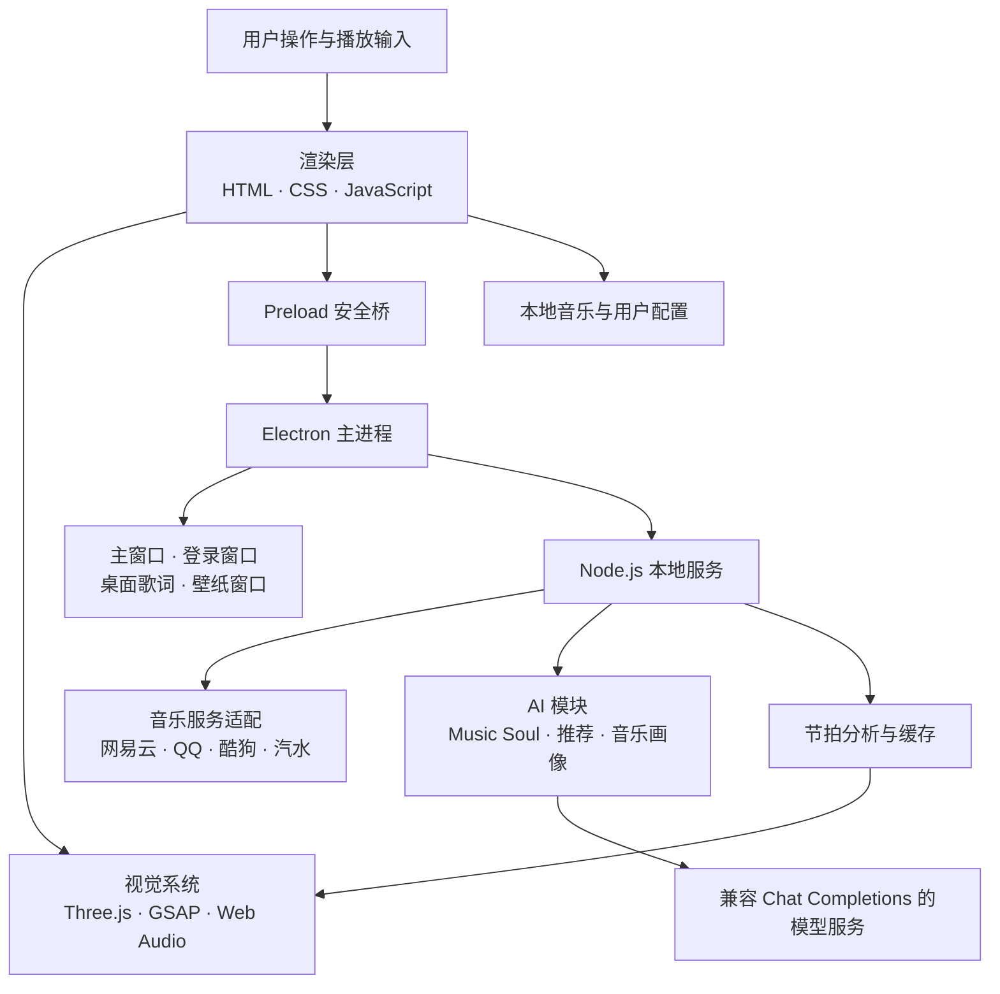

<div align="center">
  

  <h1>Mineradio</h1>

  <p><strong>把音乐播放、AI 推荐与实时视觉体验装进一个桌面应用。</strong></p>
  <p>支持多音乐源、Music Soul AI DJ、桌面歌词、动态壁纸、粒子舞台与 3D 歌单浏览的沉浸式音乐播放器。</p>

  <p>
    
    
    
    
    <a href="./LICENSE"></a>
  </p>

  <p>
    <a href="#-项目简介">项目简介</a> ·
    <a href="#-功能亮点">功能亮点</a> ·
    <a href="#-运行效果">运行效果</a> ·
    <a href="#️-技术架构">技术架构</a> ·
    <a href="#-快速开始">快速开始</a> ·
    <a href="#-贡献指南">贡献指南</a>
  </p>
</div>


## 📖 项目简介

Mineradio 是一款面向 Windows 桌面的沉浸式音乐播放器。它把传统播放器中的搜索、歌单、歌词和播放队列，与实时音频分析、Three.js 视觉舞台、桌面覆盖层和 AI 音乐推荐整合在同一个应用中。
原作者：https://github.com/XxHuberrr/Mineradio.git，本项目是在原有基础上进行功能迭代以及优化增加

项目希望解决两个实际问题：一是不同音乐来源和本地音乐分散在多套交互中；二是普通播放器的视觉反馈与音乐内容缺少联系。Mineradio 通过本地 Node.js 服务统一音乐数据请求，再由 Electron 管理主窗口、登录窗口、桌面歌词和壁纸窗口；渲染层根据播放进度、频段能量与节拍分析驱动歌词、粒子和镜头效果。

它既是一款可以直接运行的桌面应用，也是一份 Electron 多窗口、多媒体可视化、第三方服务接入与 AI 能力落地的工程实践。仓库适合作为开源应用参考、桌面端作品集或技术面试项目展示。

> [!NOTE]
> 部分在线音乐内容、音质和账号能力取决于对应平台的可用性、登录状态与用户权益。AI DJ 需要用户自行配置兼容的 API Key；未配置时不影响基础播放和可视化功能。

## ✨ 功能亮点

### 1. 多来源音乐入口

统一承载网易云音乐、QQ 音乐、酷狗音乐、汽水歌单导入与本地音频。Node.js 本地服务封装搜索、歌曲地址、歌词、歌单、评论和账号状态等接口，让渲染层使用一致的数据结构组织播放流程。

### 2. Music Soul AI DJ

AI DJ 可以结合用户输入、当前歌曲、播放记录和音乐画像完成对话式推荐，并把推荐结果直接衔接到搜索与播放。AI 配置支持自定义兼容 Chat Completions 的地址、模型与鉴权方式，密钥保存在用户本地配置中，不写入前端资源。

### 3. 音频驱动的视觉舞台

播放器通过 Web Audio、`mpg123-decoder` 和节拍分析模块提取音频能量与节奏信息，驱动粒子、摄像机、歌词和电影化动态。缓存机制避免同一音频反复分析，在效果与运行成本之间取得平衡。

### 4. 3D 歌单架与舞台歌词

Three.js 构建立体歌单卡片、景深镜头和大字歌词舞台，GSAP 负责界面过渡。用户可以在侧边歌单架与沉浸式舞台间切换，并调整镜头、尺寸、色彩与显示内容。

### 5. 桌面歌词与动态壁纸

Electron 独立透明窗口承载置顶桌面歌词，支持锁定、防误触、进度高亮和电影震动；壁纸窗口可加载视频或场景资源，并在 Windows 桌面层中保持与播放状态同步。

### 6. 天气电台与场景推荐

天气电台根据定位或手动城市获取天气信息，生成适合当前环境的播放队列。首页同时整合最近播放、常听歌手、歌单和今日推荐，让用户从熟悉内容快速进入播放。

### 7. 可持久化的个性设置

界面提供颜色、透明度、字体、背景媒体、歌词、3D 歌单架、渲染质量与控制台行为等设置。v1.3.5 进一步支持界面字体主题和 Music Soul 展示栏独立壁纸，配置保存在本地。

## 🖼️ 运行效果

### 首页与 Music Soul 总览


首页将 Music Soul、当前推荐、个人歌单、最近播放和 3D 歌单架放在同一沉浸式空间中；背景、粒子、卡片与播放状态会随当前内容变化。

### 核心功能

| Music Soul AI DJ | 多平台账号管理 |
|---|---|
|  |  |
| 通过自然语言描述想听的歌，接收带歌曲卡片的推荐并继续播放。 | 在统一弹窗中查看不同音乐平台的账号入口与登录状态。 |

## 🏗️ 技术架构



- **渲染层**：负责播放器界面、Music Soul、播放队列、歌词、3D 场景和个性化设置。
- **Electron 主进程**：管理应用生命周期、多窗口、托盘、快捷键、平台登录与 Windows 桌面集成。
- **本地服务层**：提供静态资源和统一 API，处理音乐搜索、歌单、歌词、音频代理、天气、更新与 AI 请求。
- **数据与 AI 层**：音乐平台和本地文件提供播放数据；AI 模块生成推荐与音乐画像；敏感配置仅存放在用户本机。
- **扩展方式**：新增音乐来源可在服务层添加适配接口，再复用渲染层已有歌曲结构；新增视觉效果可接入统一的音频与节拍状态。

## 🧩 技术栈

| 分类 | 技术 |
|---|---|
| 桌面端 | Electron 33、Electron IPC、Windows 桌面窗口集成 |
| 前端 | HTML、CSS、JavaScript、Three.js r128、GSAP、Web Audio API |
| 本地服务 | Node.js、原生 HTTP 服务、NeteaseCloudMusicApi |
| 音频处理 | mpg123-decoder、Music Tempo、本地节拍分析与缓存 |
| AI | MiMo 默认配置、兼容 Chat Completions 的自定义模型接口 |
| 构建 | electron-builder、NSIS、Windows x64 |

## 🚀 快速开始

### 环境要求

- Windows 10/11 x64
- Node.js 18 或更高版本
- npm 9 或更高版本

### 1. 克隆项目

```bash
git clone https://github.com/zzyxiangnian-star/Mineradio.git
cd Mineradio
```

### 2. 安装依赖

```bash
npm install
```

### 3. 配置 AI（可选）

推荐启动应用后在 AI 设置中填写，配置会保存在当前用户的数据目录中。也可以在启动前通过终端设置环境变量；`.env.example` 列出了所有可用变量，但应用不会自动读取 `.env` 文件。

```powershell
$env:MIMO_API_KEY="你的 API Key"
npm start
```

未配置 API Key 时仍可正常使用非 AI 功能。

### 4. 启动项目

```bash
npm start
```

### 5. 构建 Windows 安装包

```bash
# NSIS 安装包
npm run build

# Windows 便携版
npm run build:portable
```

构建产物生成在 `dist/`，该目录不会提交到 Git。

## 📁 项目结构

```text
Mineradio/
├─ build/                    # 应用图标与 Windows 安装器资源
├─ docs/
│  ├─ images/               # README Logo、预览图与真实运行截图
│  └─ superpowers/          # 本次仓库优化的设计与实施记录
├─ public/
│  ├─ index.html            # 主界面、播放器和 3D 视觉系统
│  ├─ desktop-lyrics.html   # 桌面歌词渲染页
│  ├─ wallpaper.html        # 动态壁纸渲染页
│  ├─ assets/               # 应用内视觉资源
│  └─ vendor/               # 浏览器端第三方库
├─ src/
│  ├─ desktop/              # Electron 主进程与 Preload 安全桥
│  ├─ lib/ai/               # AI 配置、请求、推荐与音乐画像
│  ├─ lib/qishui.js         # 汽水歌单导入支持
│  └─ dj-analyzer.js        # 节拍与 DJ 音频分析
├─ server.js                # 本地 HTTP 服务与音乐平台适配接口
├─ test-ai-modules.js       # AI 模块测试
├─ package.json             # 依赖、启动命令与打包配置
└─ .env.example             # 可选 AI 环境变量示例
```

## 🔧 配置说明

| 变量 | 必填 | 默认值 | 说明 |
|---|---:|---|---|
| `MIMO_API_KEY` | 否 | 空 | 启用 Music Soul / AI DJ 所需的用户密钥 |
| `MIMO_BASE_URL` | 否 | `https://api.xiaomimimo.com/v1` | 兼容 Chat Completions 的 API 根地址 |
| `MIMO_MODEL` | 否 | `mimo-v2.5-pro` | 模型名称 |
| `MIMO_AUTH_METHOD` | 否 | `api-key` | 支持 `api-key` 或 `bearer` |
| `MINERADIO_USER_DATA_DIR` | 否 | 系统用户数据目录 | 覆盖 AI 本地配置的存放位置 |

音乐平台登录 Cookie 和 AI 配置只保存在本地，并已加入 `.gitignore`。请勿把 `.env`、Cookie 文件或用户数据上传到 Issue、日志或提交中。

## 🗺️ Roadmap

- [x] 多音乐来源搜索、歌单与播放流程
- [x] Music Soul AI DJ 与音乐画像
- [x] 实时粒子、节拍镜头与 3D 歌单架
- [x] 桌面歌词和 Windows 动态壁纸
- [x] Windows NSIS 安装包与便携版构建
- [ ] 增加自动化测试和持续集成
- [ ] 评估 macOS / Linux 桌面能力与平台差异
- [ ] 补充关键交互的演示 GIF

## 🤝 贡献指南

欢迎提交 Issue 和 Pull Request。开始前请阅读 [CONTRIBUTING.md](./CONTRIBUTING.md)，其中包含本地开发、验证命令、PR 要求和敏感信息注意事项。

版本变化记录见 [CHANGELOG.md](./CHANGELOG.md)。

## 📄 License

本项目基于 [MIT License](./LICENSE) 开源。第三方音乐内容、接口和品牌仍归其各自权利方所有，使用时请遵守对应服务条款与所在地区法律法规。
