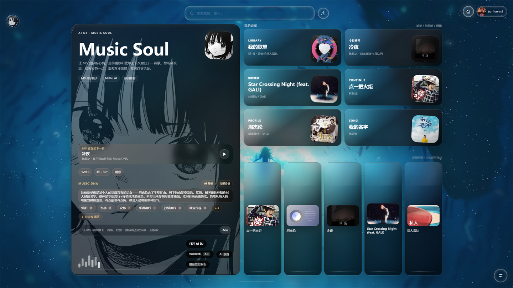
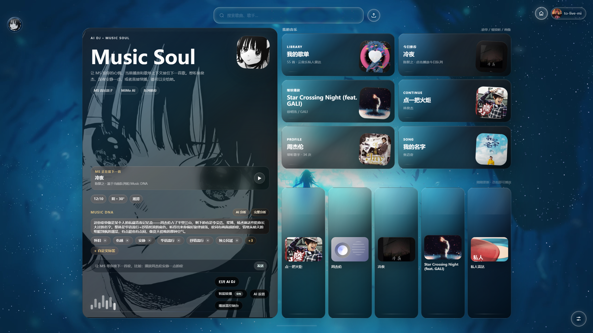
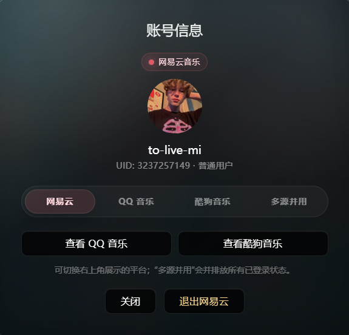
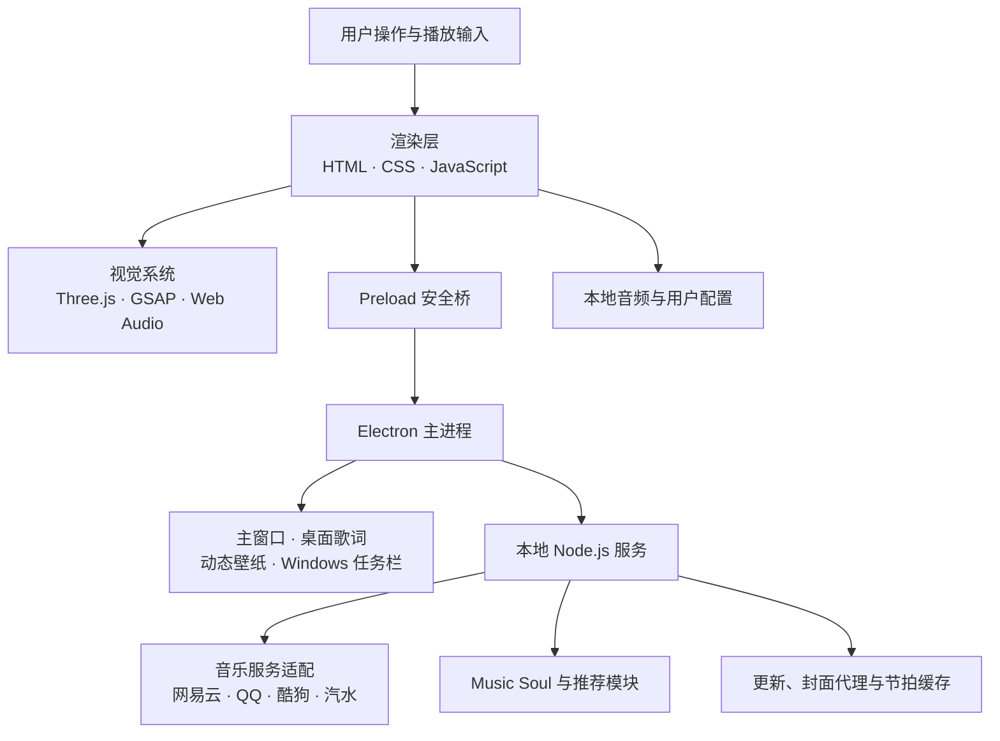

<div align="center">
  

  <h1>Mineradio</h1>

  <p><strong>面向 Windows 的沉浸式开源音乐播放器</strong></p>
  <p>把多来源音乐、Music Soul AI DJ、桌面歌词、动态壁纸和音频驱动视觉装进一个 Electron 应用。</p>

  <p>
    
    
    
    
    <a href="./LICENSE"></a>
  </p>

  <p>
    <a href="#项目简介">项目简介</a> ·
    <a href="#140-版本亮点">1.4.0 亮点</a> ·
    <a href="#快速开始">快速开始</a> ·
    <a href="#测试与构建">测试与构建</a> ·
    <a href="#贡献与安全">参与贡献</a>
  </p>
</div>



## 项目简介

Mineradio 是一款以 Windows 桌面体验为核心的沉浸式音乐播放器。它把搜索、歌单、歌词和播放队列，与 Three.js 视觉舞台、Web Audio 分析、桌面覆盖层、天气电台及 AI 音乐推荐整合在同一个应用中。

项目通过本地 Node.js 服务统一处理音乐平台、歌词、封面、评论、登录状态和更新请求；Electron 主进程负责窗口、托盘、快捷键、桌面歌词、壁纸与 Windows 任务栏集成；渲染层根据歌曲、频段能量和播放进度驱动歌词、粒子和镜头效果。

> [!IMPORTANT]
> 本仓库是基于原项目 [XxHuberrr/Mineradio](https://github.com/XxHuberrr/Mineradio.git) 持续迭代的独立维护版本。原始创意与基础实现归原项目作者；本仓库负责后续功能扩展、优化、测试和发布，不代表原作者官方版本。

> [!NOTE]
> 在线音乐的可用性、音质和账号能力取决于对应平台、地区、登录状态、会员权益及版权政策。请遵守当地法律和各平台服务条款。

## 1.4.0 版本亮点

- **Windows 任务栏音乐卡片**：同步当前歌曲、封面和播放状态，并通过原生模块接入任务栏缩略图预览。
- **外部歌单链接导入**：识别网易云音乐、QQ 音乐、酷狗音乐和汽水音乐歌单链接，统一导入播放列表。
- **歌单面板重构**：歌单详情在左侧面板内行内展开，减少重复卡片并改善长标题和滚动布局。
- **酷狗来源优化**：改进歌曲字段归一化、标题/歌手/时长匹配，以及登录、VIP、版权和地址不可用提示。
- **Music Soul 聊天壁纸**：可为 AI DJ 聊天区域选择独立图片，并安全保存到用户数据目录。
- **在线更新流程**：完善版本元数据、更新提示、下载进度、错误状态和安装器打开流程。

完整版本记录见 [CHANGELOG.md](./CHANGELOG.md)。

## 核心功能

### 多来源音乐与歌单

- 聚合网易云音乐、QQ 音乐、酷狗音乐、汽水音乐歌单和本地音频。
- 提供搜索、歌曲地址、歌词、评论、歌单、账号状态和封面代理等统一接口。
- 支持平台登录信息保存在本机用户数据目录，不把 Cookie 写入前端资源。

### Music Soul AI DJ

- 根据用户输入、当前歌曲和播放上下文进行对话式推荐。
- 推荐结果可以继续搜索和播放，基础播放器功能不依赖 AI 配置。
- 支持兼容 Chat Completions 的地址、模型和鉴权配置；密钥仅保存在本地。

### 音频驱动视觉

- 使用 Web Audio 与 `mpg123-decoder` 分析音频能量和节奏。
- 通过 Three.js 与 GSAP 驱动 3D 歌单架、歌词舞台、粒子、镜头和背景效果。
- 支持渲染质量、主题、透明度、字体、歌词和视觉参数的本地持久化设置。

### Windows 桌面体验

- 独立桌面歌词窗口、动态壁纸窗口、托盘和全局播放控制。
- 支持任务栏缩略图音乐卡片、播放状态同步及原生图像桥接。
- 提供 NSIS 安装包和 Windows x64 便携版构建配置。

### 天气与场景电台

- 根据定位或手动城市获取天气信息并组织场景推荐。
- 首页整合最近播放、常听歌手、个人歌单、播客和今日推荐。

## 运行效果

### 首页与 Music Soul 总览



### 核心功能

| Music Soul AI DJ | 多平台账号管理 |
|---|---|
|  |  |
| 通过自然语言描述想听的音乐，并把推荐结果衔接到搜索和播放。 | 在统一入口查看不同音乐平台的登录方式与账号状态。 |

## 技术架构



- **渲染层**：播放器 UI、Music Soul、播放队列、歌词、3D 场景和个性化设置。
- **Electron 主进程**：应用生命周期、多窗口、托盘、快捷键、本地服务与 Windows 桌面集成。
- **本地服务**：静态资源与统一 API，负责音乐平台请求、音频代理、天气、更新和 AI 请求。
- **原生扩展**：`native/taskbar-thumbnail` 使用 Node-API 将渲染后的任务栏卡片像素交给 Windows 缩略图窗口。

## 技术栈

| 领域 | 技术 |
|---|---|
| 桌面运行时 | Electron 33、Node.js |
| 用户界面 | HTML、CSS、原生 JavaScript、GSAP |
| 3D 与音频 | Three.js r128、Web Audio、mpg123-decoder |
| 本地服务 | Node.js HTTP、NeteaseCloudMusicApi |
| 原生模块 | Node-API、C++、Windows DWM/GDI |
| 测试 | Node.js `node:test` |
| 打包 | electron-builder、NSIS |

## 快速开始

### 环境要求

- Windows 10/11 x64。
- Node.js 18 或更高版本，推荐使用当前 LTS。
- npm 9 或更高版本。
- Visual Studio 2022 Build Tools，勾选“使用 C++ 的桌面开发”和 Windows SDK；任务栏原生模块需要该工具链。
- Git。

### 获取源码

```powershell
git clone https://github.com/zzyxiangnian-star/Mineradio.git
cd Mineradio
```

### 安装依赖

推荐先跳过依赖生命周期脚本，再明确安装 Electron 和重建原生模块，避免本地文件依赖被错误地按普通 Node ABI 编译：

```powershell
npm install --ignore-scripts
node node_modules/electron/install.js
npm run rebuild:native
```

如果你的 Windows C++ 工具链已完整配置，也可以直接运行 `npm install`，然后执行 `npm run rebuild:native` 确保原生模块与当前 Electron ABI 一致。

### 可选配置

```powershell
Copy-Item .env.example .env
```

Music Soul AI DJ 需要兼容接口的 API Key；未配置时不会影响搜索、播放、歌词和视觉功能。变量说明见 [.env.example](./.env.example)。

### 启动

```powershell
npm start
```

应用会启动本地服务，并由 Electron 打开桌面窗口。默认数据写入 Electron 的用户数据目录；不要把 Cookie、密钥或用户数据提交到仓库。

## 测试与构建

### 运行测试

```powershell
npm test
```

测试覆盖歌单链接识别、歌单面板模型、酷狗匹配、聊天壁纸、任务栏卡片、原生缩略图桥接和更新元数据。原生模块测试要求 Electron 二进制和 `npm run rebuild:native` 已完成。

### 重建任务栏原生模块

```powershell
npm run rebuild:native
```

### 构建 Windows 安装包

```powershell
npm run build
```

输出为 `dist/Mineradio-Setup-1.4.0.exe` 及 electron-builder 生成的相关文件。

### 构建 Windows 便携版

```powershell
npm run build:portable
```

构建产物位于 `dist/`，不应直接提交到源码仓库；适合通过 GitHub Releases 发布。

## 项目结构

```text
Mineradio/
├─ build/                    # 图标、NSIS 配置和打包脚本
├─ docs/                     # 项目图片、设计和实施文档
├─ native/taskbar-thumbnail/ # Windows 任务栏 Node-API 原生模块
├─ public/                   # 播放器、歌词、壁纸和前端资源
├─ src/desktop/              # Electron 主进程、preload 与桌面能力
├─ src/lib/ai/               # Music Soul 配置、客户端与推荐逻辑
├─ test/                     # Node.js 自动化测试
├─ server.js                 # 本地 HTTP 服务与音乐平台适配
└─ package.json              # 版本、依赖、脚本和打包配置
```

## 配置与数据安全

- `.env`、`.cookie`、`.qq-cookie`、`.kugou-cookie`、缓存、更新下载和安装产物已通过 `.gitignore` 排除。
- `MIMO_API_KEY` 只应存放在本机 `.env` 或应用设置中，不要写进截图、Issue、日志或提交记录。
- `MINERADIO_USER_DATA_DIR` 可覆盖 AI 配置等本地数据目录；大多数用户应保持为空。
- 更新源默认指向本仓库的 GitHub Releases，并可使用配置中的镜像前缀；发布安装包前请核对来源和校验信息。
- 本项目不提供、托管或绕过受版权保护的音乐内容；播放能力取决于第三方平台公开能力和用户自身权限。

## 常见问题

### Electron 提示安装不完整

如果 `require('electron')` 提示安装失败，先运行：

```powershell
node node_modules/electron/install.js
```

然后确认 `node_modules/electron/dist/electron.exe` 存在，并重新执行 `npm run rebuild:native`。

### 原生模块无法加载

确认已安装 Visual Studio 2022 C++ Build Tools 和 Windows SDK，然后运行：

```powershell
npm run rebuild:native
npm test
```

不要把其他 Node.js 或 Electron 版本生成的 `.node` 文件复制进项目。

### 在线歌曲无法播放

常见原因包括版权、地区、登录、会员、接口变更或歌曲地址过期。可尝试登录对应平台、切换来源或选择其他搜索结果。这类平台可用性问题通常不属于安全漏洞。

### Music Soul 没有响应

确认已在应用设置或 `.env` 中配置正确的 API Key、Base URL、模型和鉴权方式，并检查服务是否兼容 Chat Completions 请求格式。

## 贡献与安全

- 开发流程、Issue 和 PR 要求见 [CONTRIBUTING.md](./CONTRIBUTING.md)。
- 安全漏洞请按 [SECURITY.md](./SECURITY.md) 私下报告，不要在公开 Issue 中披露密钥或可利用细节。
- 发布历史见 [CHANGELOG.md](./CHANGELOG.md)。

## 项目来源与许可证

本仓库基于 [XxHuberrr/Mineradio](https://github.com/XxHuberrr/Mineradio.git) 继续开发，并由 `zzyxiangnian-star/Mineradio` 独立维护。感谢原项目作者和所有依赖项目的贡献者。

代码依据 [MIT License](./LICENSE) 开源。第三方音乐平台、图片、字体、API 和媒体内容仍受各自权利人及服务条款约束。
